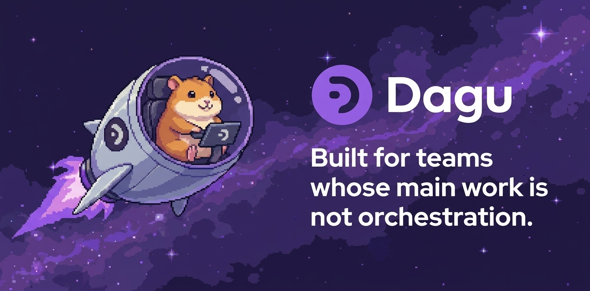
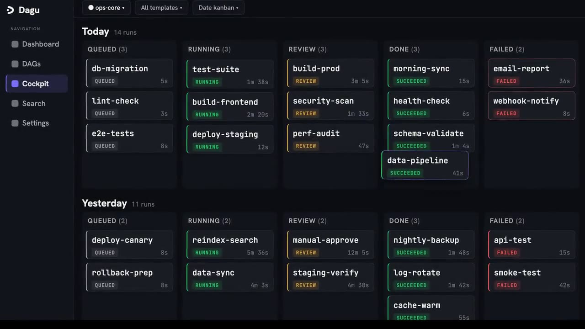
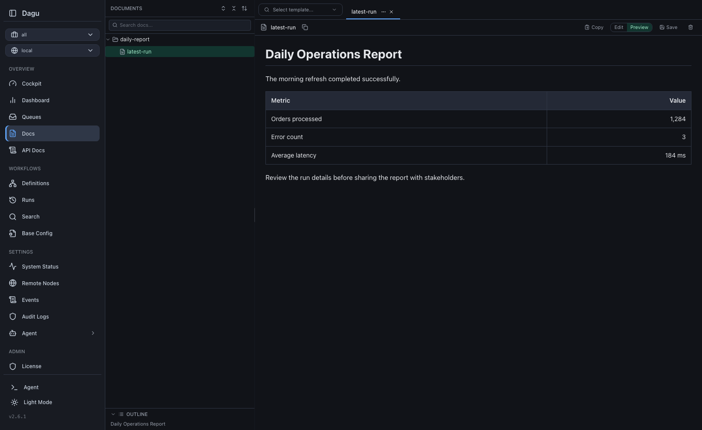
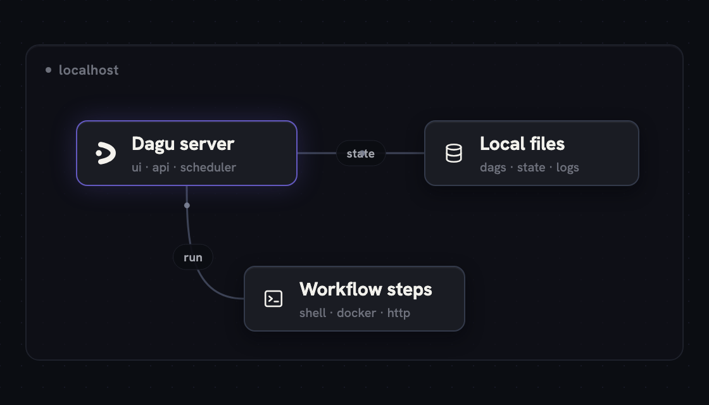
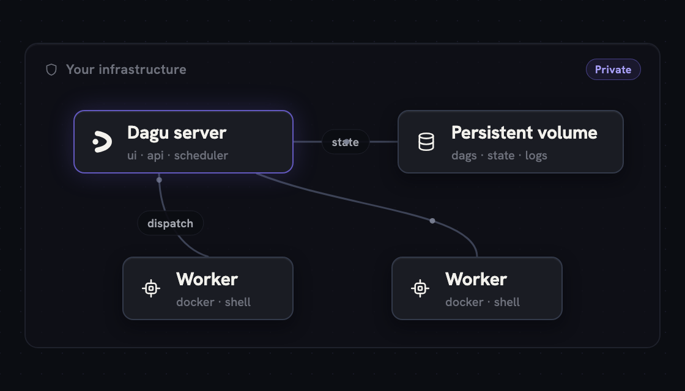
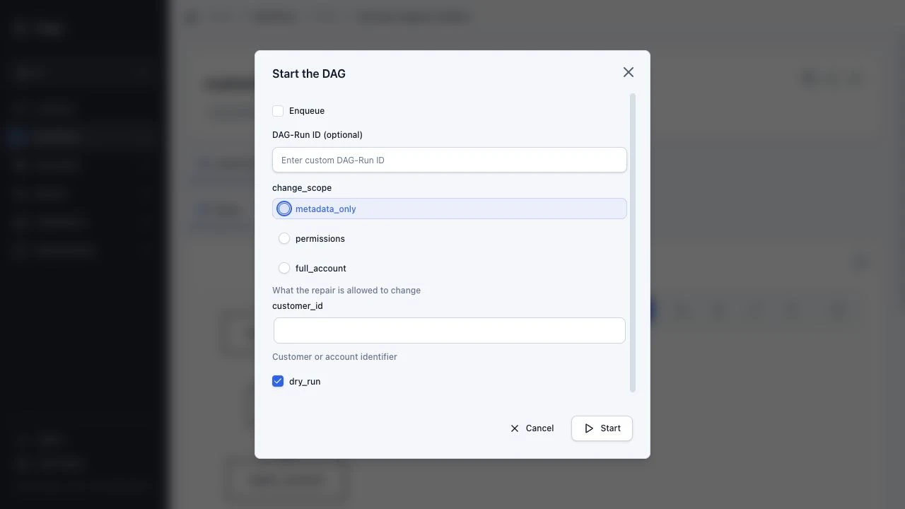
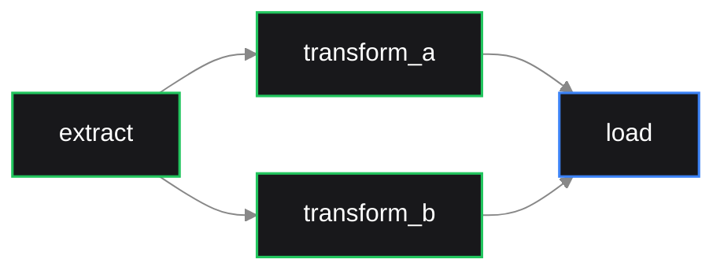

<div align="center">
  <a href="https://dagu.sh">
    
  </a>
  <p>
    <a href="https://docs.dagu.sh">Docs</a> ·
    <a href="https://docs.dagu.sh/writing-workflows/examples">Examples</a> ·
    <a href="https://dagu-demo-f5e33d0e.dagu.sh">Live demo</a>
    <code>(username/password: demouser)</code> ·
    <a href="https://discord.gg/gpahPUjGRk">Discord</a>
  </p>
</div>

<h1>Dagu</h1>

Dagu is a local-first workflow engine for ops automation and AI-assisted operations. It is open source and self-hostable: a single binary with a built-in Web UI, no external database or message broker, running on Linux / Mac / Windows. Define [DAGs](https://en.wikipedia.org/wiki/Directed_acyclic_graph) in a declarative YAML format. It natively supports shell commands, Docker containers, Kubernetes Jobs, remote commands via SSH, external coding-agent CLIs through `harness.run`, and more through Dagu Actions.

Dagu turns existing scripts, runbooks, and agent-driven jobs into production workflows with scheduling, retries, approvals, and run history. It runs where your data and credentials live: on-prem, air-gapped, edge, or cloud, and scales from a single node to a distributed worker fleet.

**Highlights:**

- Single binary file installation.
- Declarative YAML format for defining DAGs.
- Web UI for visually managing, retrying, and monitoring pipelines.
- Use existing scripts or tools without any modifications.
- Self-contained, with no need for a DBMS.
- Built-in MCP support for AI agents to manage workflows.
- Run external coding-agent CLIs through `harness.run` when workflows need AI assistance.

## Quick Look

For a quick look at how workflows are defined, see the examples.

<div align="center">
  <a href="./assets/images/dagu-demo.mp4?raw=1">
    
  </a>
</div>

| Run Details | Step Logs | Documents |
|---|---|---|
|  |  |  |

**Try it live:** [Live Demo](https://dagu-demo-f5e33d0e.dagu.sh) (credentials: `demouser` / `demouser`)

## Why Dagu?

Orchestration is not your main work. You have scripts and containers that already work. You want a schedule, retries, dependencies, and a place to see logs. The usual options each have a cost:

- **cron** runs commands, but gives you no dependencies, no retries, no history.
- **Airflow** orchestrates, but you operate a platform for it (scheduler, metadata database, workers, a Python environment), and your jobs get rewritten as `@dag`/`@task` framework code.
- **Temporal** gives durable execution, but your business logic moves into its SDK and programming model.

You wanted to schedule some jobs. Now you operate a second system, and the orchestrator lives inside the code it was supposed to serve.

Dagu treats workflow structure as configuration, not code. Order, dependencies, retries, schedules, and approvals go in one YAML file next to your scripts; the engine that runs them is a single process:

```sh
  Traditional Orchestrator          Dagu
  ┌────────────────────────┐        ┌──────────────────┐
  │  Web Server            │        │                  │
  │  Scheduler             │        │  dagu start-all  │
  │  Worker(s)             │        │                  │
  │  PostgreSQL            │        └──────────────────┘
  │  Redis / RabbitMQ      │         Single binary.
  │  Python Runtime        │         Self-hosted.
  └────────────────────────┘         Adds scheduling, retries, and approvals around existing automation.
    6+ services to manage
```

Your scripts never import the orchestrator. Delete the YAML and they run exactly as before. Keep it, and every run gets a dependency graph, retries, per-step logs, history, and a Web UI.

## Performance

Dagu stores state in local files and reaches production throughput without external services.

- **Throughput:** A single machine can run thousands of workflow runs per day. Actual capacity depends on CPU, memory, disk, and workflow shape.
- **Load control:** Queues, concurrency limits, and resource limits control how many runs execute at once and where they run.
- **Scale out:** Distributed workers spread execution across machines when one node is not enough.

## Real-World Use Cases

| Use Case | How Dagu Helps |
| --- | --- |
| ETL and data operations | Turn data extraction scripts, SQL queries, dbt commands, and data-processing runbooks into observable pipelines with durable execution. |
| Legacy scripts and scheduled jobs | Turn complex jobs with interdependencies into maintainable DAGs with a UI, automatic logging, retries, and notifications instead of opaque cron jobs and bash scripts. |
| Media conversion | Run `ffmpeg` for video transcoding and format conversion. Thanks to Dagu's file-backed nature, workers can run heavy conversions in parallel without single machine bottlenecks or external databases. |
| Infrastructure and server automation | Run any command or script over SSH on remote servers, keeping logs, results, and notifications in one place. |
| GitHub-driven workflows | Trigger workflows from GitHub events. This is useful for running automation on private infrastructure without exposing your servers to the public internet. |
| Container and Kubernetes workflows | Run Docker containers and Kubernetes Jobs as steps in your workflows without building a custom control plane around containers. |
| Customer support automation | Run self-service support tools that non-engineering teams can use to run approved workflows for running diagnostics, querying databases, and performing common support tasks without escalating to engineering. |
| IoT and edge workflows | Run sensor polling, local ML inference, data preprocessing, backups, offline sync, health checks, etc. Dagu keeps these jobs close to the data source while still providing Web UI visibility. |

## Quick Start

### Install

**macOS/Linux:**

```sh
curl -fsSL https://raw.githubusercontent.com/dagucloud/dagu/main/scripts/installer.sh | bash
```

**Homebrew:**

```sh
brew install dagu
```

**npm:**

```sh
npm install -g --ignore-scripts=false @dagucloud/dagu
```

**Windows (PowerShell):**

```powershell
irm https://raw.githubusercontent.com/dagucloud/dagu/main/scripts/installer.ps1 | iex
```

**Docker:**

```sh
docker run --rm -v ~/.dagu:/var/lib/dagu -p 8080:8080 ghcr.io/dagucloud/dagu:latest dagu start-all
```

**Kubernetes (Helm):**

```sh
helm repo add dagu https://dagucloud.github.io/dagu
helm repo update
helm install dagu dagu/dagu --set persistence.storageClass=<your-rwx-storage-class>
```

> Replace `<your-rwx-storage-class>` with a StorageClass that supports `ReadWriteMany`. See [charts/dagu/README.md](./charts/dagu/README.md) for chart configuration.

The script installers run a guided wizard that can add Dagu to your PATH, set it up as a background service, and create the initial admin account. Homebrew, npm, Docker, and Helm install without the wizard. See the [Installation documentation](https://docs.dagu.sh/getting-started/installation/) for all options.

### Create and run a workflow

Create `hello.yaml`:

```yaml
steps:
  - id: hello
    run: echo "hello from Dagu"
```

Run the workflow with:

```sh
dagu start hello.yaml
```

### Start the server

```sh
dagu start-all --dags .
```

Visit http://localhost:8080

### Connect AI agents through MCP

Dagu exposes a built-in MCP server from the running HTTP server. Start Dagu, then configure MCP-capable chat or coding agents to use the Streamable HTTP endpoint:

```text
http://localhost:8080/mcp
```

Use MCP when you want an AI agent to read Dagu state and Markdown documents, preview or apply workflow and document changes, and start, enqueue, retry, or stop runs through `dagu_read`, `dagu_change`, and `dagu_execute`. See the [MCP setup guide](https://docs.dagu.sh/mcp/quickstart).

For authoring-only help in Claude Code, Codex, Gemini CLI, and other AI coding tools, install the Dagu workflow authoring skill:

```sh
gh skill install dagucloud/dagu dagu
```

## How You Run Dagu?

Run Dagu on one machine, or scale out with distributed workers. See the [Deployment Models guide](https://docs.dagu.sh/overview/deployment-models).

<table>
  <tr>
    <td width="50%" align="center" valign="top">
      <strong>Single Server</strong><br>
      
    </td>
    <td width="50%" align="center" valign="top">
      <strong>Distributed Workers</strong><br>
      
    </td>
  </tr>
</table>

| Model | Server | Execution | Best for |
|------|--------|-----------|----------|
| **Single server** | `dagu start-all` on one machine. | Same machine. | Development, single-machine scheduled workloads, edge jobs, and internal automation. |
| **Distributed workers** | Dagu server and coordinator on your infrastructure. | Workers on separate machines, routed by labels. | Heavier workloads, private networks, and multiple execution hosts. |

### Licensing

- **Community self-host:** No license key required. You operate the server, storage, upgrades, networking, and workers. Start with the [installation guide](https://docs.dagu.sh/getting-started/installation/).
- **Self-host license:** Adds SSO, RBAC, audit logging, and incident SaaS integration to Dagu. See [self-host licensing](https://dagu.sh/pricing#self-host).

## Key Features

- **Observability:** Shared workflows and scheduling with clear visualizations, status tracking, and logs in the Web UI.
- **Language-agnostic:** No framework required. Define workflow steps using shell commands, Docker containers, Kubernetes Jobs, SQL queries, HTTP requests, and any other tool via official and third-party Dagu Actions.
- **Build workflows:** Reuse a step's result when its command and files have not changed. Dagu can also infer dependencies from matching file paths.
- **Reproducibility:** Reproducible runs with pinned tools, plus automatic installation and caching on workers—eliminating the need to manually install dependencies on the server or workers.
- **Built-in Approvals:** The Human-in-the-loop steps for manual approvals, review, and intervention in any workflow.
- **MCP Server:** Built-in MCP server for authoring and running workflows via AI agents like Claude Code, Codex, Gemini CLI, Pi, OpenCode, and more.
- **External CLI Harness:** You can run coding-agent CLIs (Claude Code, Codex, Gemini CLI, Pi, OpenCode, etc.) with a built-in harness action or custom harness definition.
- **Secret management:** Built-in secret management with secure log masking, preventing credentials from leaking into logs or the Web UI.
- **Self-hosted:** A single binary that runs on Linux, macOS, and Windows. Includes an optional distributed worker mode for scaling out execution across machines.
- **Permission Control:** RBAC and SSO support for team environments, controlling who can view, run, and edit workflows through granular permissions and audit logging.

## Architecture

Dagu can run in three configurations:

**Standalone:** A single `dagu start-all` process runs the HTTP server, scheduler, and executor. Suitable for single-machine deployments.

**Coordinator/Worker:** The scheduler enqueues jobs to a local file-based queue, then dispatches them to a coordinator over gRPC. Workers long-poll the coordinator for tasks, execute DAGs locally, and report status back. Workers can run on separate machines and are routed tasks based on labels.

**Headless:** Run without the web UI (`DAGU_HEADLESS=true`). Useful for CI/CD environments or when Dagu is managed through the CLI or API only.

```sh
Standalone:

  ┌─────────────────────────────────────────┐
  │  dagu start-all                         │
  │  ┌───────────┐ ┌───────────┐ ┌────────┐ │
  │  │ HTTP / UI │ │ Scheduler │ │Executor│ │
  │  └───────────┘ └───────────┘ └────────┘ │
  │  File-based storage (logs, state, queue)│
  └─────────────────────────────────────────┘

Distributed:

  ┌────────────┐                   ┌────────────┐
  │ Scheduler  │                   │ HTTP / UI  │
  │            │                   │            │
  │ ┌────────┐ │                   └─────┬──────┘
  │ │ Queue  │ │  Dispatch (gRPC)        │ Dispatch / GetWorkers
  │ │(file)  │ │─────────┐               │ (gRPC)
  │ └────────┘ │         │               │
  └────────────┘         ▼               ▼
                    ┌─────────────────────────┐
                    │      Coordinator        │
                    │  ┌───────────────────┐  │
                    │  │ Dispatch Task     │  │
                    │  │ Store (pending/   │  │
                    │  │ claimed)          │  │
                    │  └───────────────────┘  │
                    └────────▲────────────────┘
                             │
                   Worker poll / task response
                   Heartbeat / ReportStatus /
                   StreamLogs (gRPC)
                             │
               ┌─────────────┴─────────────┐
               │             │             │
          ┌────┴───┐    ┌────┴───┐    ┌────┴───┐
          │Worker 1│    │Worker 2│    │Worker N│ Sandbox execution of DAGs
          │        │    │        │    │        │
          └────────┘    └────────┘    └────────┘
```

## Parameter Definition

Workflows can define parameters that render as typed input forms in the Web UI and can be referenced by steps.

```yaml
params:
  - name: customer_id
    type: string
    description: Customer or account identifier
  - name: change_scope
    type: string
    description: What the repair is allowed to change
    enum:
      - metadata_only
      - permissions
      - full_account
    default: metadata_only
  - name: dry_run
    type: boolean
    default: true

steps:
  - id: extract
    run: >-
      ./scripts/extract.sh
      --customer "${params.customer_id}"
      --scope "${params.change_scope}"
      --dry-run="${params.dry_run}"
    retry_policy:
      limit: 3
      interval_sec: 30
```

<div align="center">
  
</div>

## Workflow Examples

### Parallel executions

```yaml
steps:
  - id: extract
    run: ./extract.sh

  - id: transform_a
    run: ./transform_a.sh
    depends: extract

  - id: transform_b
    run: ./transform_b.sh
    depends: extract

  - id: load
    run: ./load.sh
    depends: [transform_a, transform_b]
```



### Reuse unchanged results

Save this as `workflow.yaml`:

```yaml
type: build
working_dir: .

steps:
  - id: uppercase
    inputs:
      - name: source
        path: source.txt
    outputs:
      - name: result
        path: uppercase.txt
    run: |
      #!/bin/sh
      tr '[:lower:]' '[:upper:]' < "${inputs.source}" > "${outputs.result}"
```

Run it:

```sh
printf 'alpha\n' > source.txt
dagu start workflow.yaml
```

Run `dagu start workflow.yaml` again and Dagu reuses `uppercase.txt`. Change `source.txt` and the step runs again. `${outputs.result}` is a temporary path that Dagu publishes as `uppercase.txt` after the command succeeds.

Build workflows currently run locally. See [Build Workflows](https://docs.dagu.sh/writing-workflows/incremental-workflows) for dependency inference and reuse rules.

### External tools with pinning and caching

```yaml
tools:
  - jqlang/jq@jq-1.7.1

steps:
  - id: inspect
    run: jq --version

  - id: summarize
    action: python-script@v1
    with:
      input:
        rows: [42, 8]
      script: |
        return {"total": sum(input["rows"])}
```

Dagu installs declared portable CLIs before the DAG run, exposes them on `PATH` for host command steps, and caches them on each worker. Tool provisioning uses [aqua](https://aquaproj.github.io/) as the default provider; the standard registry resolves to the latest aqua-registry release automatically. Pin a specific artifact with `package@version#sha256:<hex>` when the release tag alone is not a strong enough guarantee. See the [Tools documentation](https://docs.dagu.sh/writing-workflows/tools) and [Dagu Actions](https://docs.dagu.sh/dagu-actions/) for more details.

### Third-party Dagu Actions

```yaml
params:
  - BUILD_ID

steps:
  - id: notify
    action: acme/dagu-action-notify@v1.2.0
    with:
      text: "Build ${params.BUILD_ID} finished"

  - id: audit
    depends: notify
    run: 'echo "Notification result: ${steps.notify.outputs.messageId}"'
```

A third-party Dagu Action package contains a DAG, manifest, schemas, and helper files behind an `action:` reference. See the [Dagu Actions](https://docs.dagu.sh/dagu-actions/) and [Third-Party Actions](https://docs.dagu.sh/dagu-actions/third-party) documentation for details.

### Docker step

```yaml
steps:
  - name: build
    container:
      image: node:20-alpine
    run: npm run build
```

### Kubernetes Pod execution

```yaml
steps:
  - name: batch-job
    action: kubernetes.run
    with:
      namespace: production
      image: my-registry/batch-processor:latest
      resources:
        requests:
          cpu: "2"
          memory: "4Gi"
      command: ./process.sh
```

### SSH remote execution

```yaml
steps:
  - name: deploy
    action: ssh.run
    with:
      host: prod-server.example.com
      user: deploy
      key: ~/.ssh/id_rsa
      command: cd /var/www && git pull && systemctl restart app
```

Declare `ssh` once at the DAG level and every `run` step executes on that host:

```yaml
ssh:
  user: deploy
  host: web-1.internal
  key: ~/.ssh/deploy_key

steps:
  - id: health
    run: curl -f http://localhost:8080/health
    retry_policy:
      limit: 3
      interval_sec: 10

  - id: restart
    run: systemctl restart myapp
    depends: health
```

### Sub-DAG composition

```yaml
steps:
  - id: etl
    action: dag.run
    with:
      dag: etl-pipeline
      params:
        SOURCE: s3://bucket/data.csv

---

# You can include multiple DAGs in the same YAML file, or reference DAGs defined in separate files.
name: etl-pipeline

params:
  - SOURCE

tools:
  - aws/aws-cli@2.11.14

steps:
  - id: download
    run: aws s3 cp ${params.SOURCE} data.csv

  - id: transform
    run: ./transform.sh data.csv
    depends: download

  - id: load
    run: ./load.sh transformed.csv
    depends: transform
```

### Retry and error handling

```yaml
steps:
  - name: flaky-api-call
    run: curl -f https://api.example.com/data
    retry_policy:
      limit: 3
      interval_sec: 10
    continue_on:
      failure: true
```

### Scheduling with overlap control and catch-up

```yaml
schedule:
  - "0 */6 * * *"          # Every 6 hours
overlap_policy: skip       # Skip if previous run is still active
catchup_window: "5h"       # Catch up missed runs when scheduler is down for up to 5 hours
  
timeout_sec: 3600
handler_on:
  failure:
    run: notify-team.sh
  exit:
    run: cleanup.sh
```

### External coding-agent CLI harness step with manual approval

```yaml
steps:
  - id: review
    action: harness.run
    with:
      provider: codex
      prompt: Review the README.md file and return concise Markdown findings.
    stdout:
      artifact: review.md

  - id: approval
    action: noop
    depends: review
    approval:
      prompt: Review the review.md artifact. Approve to post an issue with the findings, or reject to skip.

  - id: read_review
    action: artifact.read
    depends: approval
    with:
      path: review.md

  - id: post_issue
    run: gh issue create --title "Review Findings" --body-file "${read_review.stdout}"
    depends: read_review
```

### Scheduled agent review with human approval

Runs as-is with the [Pi coding agent](https://pi.dev) installed (`npm install -g --ignore-scripts @earendil-works/pi-coding-agent`) and an `OPENROUTER_API_KEY` exported. The run pauses at `approve` until someone answers in the Web UI:

```yaml
schedule: "0 2 * * *"
working_dir: .

secrets:
  - name: OPENROUTER_API_KEY
    provider: env
    key: OPENROUTER_API_KEY

steps:
  - id: review
    action: harness.run
    with:
      provider: pi
      model: openrouter/deepseek/deepseek-v4-flash
      tools: read,bash
      prompt: |
        Review the most recent commit in this repository.
        Reply with: what changed, one risk, a verdict.
    output: REVIEW

  - id: approve
    action: human.task
    with:
      prompt: Publish this review?
    depends: review

  - id: publish
    run: echo "$REVIEW"
    depends: approve
```

### LLM-driven workflow where the model chooses each step

```yaml
type: controller

env:
  - ANTHROPIC_API_KEY: ${ANTHROPIC_API_KEY}

llm:
  provider: anthropic
  model: claude-sonnet-4-20250514
  system: |
    If the tests fail, run the fixer and test again. Never ask for sign-off on
    a red build.

steps:
  - name: run_tests
    description: Run the test suite.
    run: |
      test -f /tmp/dagu-flaky-cleared || { echo "FAIL: flaky_test timed out"; exit 1; }
      echo "all green"

  - name: fix_flaky
    description: Quarantine the known flaky test.
    run: |
      touch /tmp/dagu-flaky-cleared
      echo "quarantined flaky_test"

  - id: sign_off
    name: sign_off
    action: human.task
    with:
      prompt: Tests are green. Ship it?
      form:
        type: object
        properties:
          approved: { type: boolean }
        required: [approved]

tasks:
  - name: tests_green
    description: Finished when run_tests succeeded on its most recent run.
  - name: approved
    description: Finished when a person answered sign_off with approved=true.
```

With `type: controller` the steps stop being a plan and become a catalog of
actions; `tasks` declares the goals and ends the run once all are settled. The
model decides what runs next, so a failing test can be fixed and retried without
that path being wired in advance. When it opens the human task the run releases
its worker slot and resumes on the same run once someone answers. `llm.model`
also accepts an array of models; the controller fails over to the next model
when a request fails, and a successful fallback stays selected for the rest of
the run.

For more examples, see the [Examples documentation](https://docs.dagu.sh/writing-workflows/examples).

## Built-in Actions

Dagu includes built-in actions that run within the Dagu process or on the selected worker. Local shell commands use the `run:` field; structured work uses `action:`.

| Action | Purpose |
|----------|---------|
| `run:` field | Local shell commands and scripts (bash, sh, PowerShell, custom shells) |
| `exec` | Direct process execution without shell parsing |
| `noop` | Output-only or approval-only placeholder step |
| `log.write` | Write structured log messages |
| `docker.run` / `container.run` | Run containers with registry auth, volume mounts, and resource limits |
| `kubernetes.run` / `k8s.run` | Execute Kubernetes Jobs with namespace, image, and resource settings |
| `ssh.run` | Remote command execution over SSH |
| `sftp.upload` / `sftp.download` | File transfer over SFTP |
| `http.request` | HTTP requests with headers, auth, and request bodies |
| `chat.completion` | Run an LLM chat completion step |
| `harness.run` | Run external coding-agent CLIs such as Claude Code, Codex, Copilot, OpenCode, and Pi |
| `postgres.query` / `postgres.import` | PostgreSQL queries and imports |
| `sqlite.query` / `sqlite.import` | SQLite queries and imports |
| `redis.<operation>` | Redis commands, pipelines, and Lua scripts |
| `s3.upload` / `s3.download` / `s3.list` / `s3.delete` | Upload, download, list, and delete S3 objects |
| `file.stat` / `file.read` / `file.write` / `file.copy` / `file.move` / `file.delete` / `file.mkdir` / `file.list` | Local file operations without shell commands |
| `artifact.write` / `artifact.read` / `artifact.list` | Write, read, and list DAG-run artifacts |
| `state.get` / `state.set` / `state.delete` / `state.list` / `state.diff` | Persistent JSON state across DAG runs |
| `data.convert` / `data.pick` | Convert and select structured data |
| `jq.filter` | JSON transformation using jq expressions |
| `archive.create` / `archive.extract` / `archive.list` | Create, extract, and list zip/tar archives |
| `wait.duration` / `wait.until` / `wait.file` / `wait.http` | Wait for time, file state, or HTTP readiness |
| `human.task` | Wait for acknowledgement or typed operator input before downstream steps continue |
| `mail.send` | Send email via SMTP |
| `template.render` | Text generation with template rendering |
| `router.route` | Conditional step routing based on values and patterns |
| `dag.run` | Invoke another DAG as a sub-workflow with params and dependencies |
| `dag.enqueue` | Queue another DAG asynchronously and continue after enqueue |
| `git.checkout` | Clone or update Git repositories |
| `outputs.write` | Publish DAG or Dagu Action outputs for callers |

## Custom Actions

Custom Actions are inline reusable wrappers defined with the top-level `actions` field. They expand to built-in actions during DAG load, so you can wrap a common shell, HTTP, SQL, or other pattern behind a typed interface with validated input.

```yaml
actions:
  webhook.send:
    input_schema:
      type: object
      additionalProperties: false
      required: [url, text]
      properties:
        url:
          type: string
        text:
          type: string
    template:
      action: http.request
      with:
        method: POST
        url: '{{ .input.url }}'
        headers:
          Content-Type: application/json
        body: |
          {"text": {{ json .input.text }}}

steps:
  - action: webhook.send
    with:
      url: https://hooks.example.com/ops
      text: deploy complete
```

See [Custom Actions](https://docs.dagu.sh/dagu-actions/custom) and the [YAML Specification](https://docs.dagu.sh/writing-workflows/yaml-specification) for the exact `actions`, `action`, and `run` field behavior.

## Official Dagu Actions

Dagu Actions are official action packages maintained in the `dagucloud` GitHub organization. They use the same action package runtime as third-party action packages, but callers use the short form `action: name@version`.

| Dagu Action | Purpose |
|-------------|---------|
| `node-script@v1` | Run small JavaScript transforms or glue code with action-owned Node.js |
| `python-script@v1` | Run small Python transforms or glue code with action-owned Python and optional requirements |
| `dbt@v1` | Run dbt Core commands with action-owned Python and adapter requirements |
| `duckdb@v1` | Run DuckDB SQL through the DuckDB CLI without adding DuckDB to the core binary |
| `ffmpeg@v1` | Run FFmpeg conversion, transcoding, probing, and stream-processing tasks |
| `github-cli@v1` | Run GitHub issue, pull request, release, repository, and API automation through `gh` |
| `rclone@v1` | Run portable copy, sync, check, list, and storage-management workflows through rclone |

Versions are required. Pin production workflows to a version tag or commit SHA. See [Official Dagu Actions](https://docs.dagu.sh/dagu-actions/official) for the current Dagu Action list and exact input/output contracts.

For non-official packages, use [Third-Party Actions](https://docs.dagu.sh/dagu-actions/third-party) such as `action: owner/repo@version`. They contain a `dagu-action.yaml` manifest and a DAG entrypoint, run as sub-DAGs, and are transferred to distributed workers as workspace bundles after the reference is resolved. See the documentation for package layout and reference formats.

## Security and Access Control

### Authentication

Dagu supports three top-level authentication modes, configured via `DAGU_AUTH_MODE`:

- **`none`** — No authentication
- **`basic`** — HTTP Basic authentication
- **`builtin`** — JWT-based authentication with user management, API keys, per-DAG webhook tokens, and optional OIDC/SSO integration

### Role-Based Access Control

When using `builtin` auth, five roles control access:

| Role | Capabilities |
|------|-------------|
| `admin` | Full access including user management |
| `manager` | Create, edit, delete, run, stop DAGs; view audit logs |
| `developer` | Create, edit, delete, run, stop DAGs |
| `operator` | Run and stop DAGs only (no editing) |
| `viewer` | Read-only access |

API keys can be created with independent role assignments. Audit logging tracks all actions.

### TLS and Secrets

- TLS for the HTTP server (`DAGU_CERT_FILE`, `DAGU_KEY_FILE`)
- Mutual TLS for gRPC coordinator/worker communication (`DAGU_PEER_CERT_FILE`, `DAGU_PEER_KEY_FILE`, `DAGU_PEER_CLIENT_CA_FILE`)
- Secret management with environment variables, files, Kubernetes Secrets, [HashiCorp Vault](https://www.vaultproject.io/), and cloud-provider secret stores

### Production Hardening

For self-hosted production deployments, treat network exposure and execution boundaries as the primary controls:

- Prefer `auth.mode: builtin` for any shared or network-exposed instance. Use `basic` only for simple private setups, and avoid `none` outside isolated local development.
- Keep `metrics: private` unless the metrics endpoint is reachable only on a trusted private network.
- Bind Dagu to loopback or a private interface when possible. If you must use `0.0.0.0`, place it behind a trusted reverse proxy, TLS, and network-level access controls.
- Leave `terminal.enabled: false` unless the instance is admin-only and tightly scoped.
- In distributed deployments, set `peer.insecure=false` and configure peer TLS when coordinator and workers communicate across host or network boundaries.
- Treat Docker socket mounts, root containers, and host-level executors as privileged access to the underlying machine.

See [Server Configuration](https://docs.dagu.sh/server-admin/configuration), [Docker deployment](https://docs.dagu.sh/server-admin/deployment/docker), and [Distributed execution](https://docs.dagu.sh/server-admin/distributed/) for operator-focused guidance.

## Observability

### Prometheus Metrics

Dagu exposes Prometheus-compatible metrics:

- `dagu_info` — Build information (version, Go version)
- `dagu_uptime_seconds` — Server uptime
- `dagu_dag_runs_total` — Total DAG runs by status
- `dagu_dag_runs_total_by_dag` — Per-DAG run counts
- `dagu_dag_run_duration_seconds` — Histogram of run durations
- `dagu_dag_runs_currently_running` — Active DAG runs
- `dagu_dag_runs_queued_total` — Queued runs
- `dagu_workers_registered` — Registered distributed workers
- `dagu_worker_info` — Worker heartbeat labels as key/value metadata
- `dagu_worker_heartbeat_timestamp_seconds` — Last worker heartbeat timestamp
- `dagu_worker_health_status` — Worker health by heartbeat freshness
- `dagu_worker_pollers` — Worker poller capacity by state
- `dagu_worker_running_tasks` — Running tasks per worker
- `dagu_worker_oldest_running_task_age_seconds` — Age of the oldest running task per worker

### Structured Logging

JSON or text format logging (`DAGU_LOG_FORMAT`). Logs are stored per-run with separate stdout/stderr capture per step.

### Notifications

- Email notifications on DAG success, failure, or wait status via SMTP
- Per-DAG webhook endpoints with token authentication

## Artifacts


Dagu runs can write arbitrary files under `${context.paths.artifacts_dir}` in value-resolved fields, with `DAG_RUN_ARTIFACTS_DIR` also exposed to step processes. Dagu stores those files per run as Artifacts. In the Web UI, operators can browse the file tree, preview Markdown, text, and image files inline, and download any artifact when they need the raw file.

This is useful for generated reports, screenshots, charts, exported JSON or CSV files, and other outputs that do not fit simple key/value outputs.

See the [Artifacts documentation](https://docs.dagu.sh/writing-workflows/artifacts) and the [Web UI guide](https://docs.dagu.sh/overview/web-ui) for the full artifact browser workflow and screenshots.

## Scheduling and Reliability

- **Cron scheduling** with timezone support and multiple schedule entries per DAG
- **Overlap policies**: `skip` (default — skip if previous run is still active), `all` (queue all), `latest` (keep only the most recent)
- **Catch-up scheduling**: Automatically runs missed intervals when the scheduler was down
- **Zombie detection**: Identifies and handles stalled DAG runs (configurable interval, default 45s)
- **Retry policies**: Per-step retry with configurable limits, intervals, and exit code filtering
- **Human tasks**: Pause root DAG runs for acknowledgement or schema-validated operator input, locally or on distributed workers, then expose form values to downstream steps
- **Lifecycle hooks**: `onInit`, `onSuccess`, `onFailure`, `onAbort`, `onExit`, `onWait`
- **Preconditions**: Gate DAG or step execution on shell command results
- **High availability**: Scheduler lock with stale detection for failover

## Distributed Execution

The coordinator/worker architecture distributes DAG execution across multiple machines:

- **Coordinator**: gRPC server that manages task distribution, worker registry, and health monitoring
- **Workers**: Connect to the coordinator, pull tasks from the queue, execute DAGs locally, report results
- **Worker labels**: Route DAGs to specific workers based on labels (e.g., `gpu=true`, `region=us-east-1`)
- **Health checks**: HTTP health endpoints on coordinator and workers for load balancer integration
- **Queue system**: File-based persistent queue with configurable concurrency limits

```sh
# Start coordinator
dagu coordinator

# Start workers (on separate machines)
DAGU_WORKER_LABELS=gpu=true,memory=64G dagu worker
```

See the [distributed execution documentation](https://docs.dagu.sh/server-admin/distributed/) for setup details.

## CLI Reference

| Command | Description |
|---------|-------------|
| `dagu start <dag>` | Execute a DAG |
| `dagu start-all` | Start HTTP server + scheduler + coordinator |
| `dagu server` | Start HTTP server only |
| `dagu scheduler` | Start scheduler only |
| `dagu coordinator` | Start coordinator (distributed mode) |
| `dagu worker` | Start worker (distributed mode) |
| `dagu stop <dag>` | Stop a running DAG |
| `dagu restart <dag>` | Restart a DAG |
| `dagu retry --run-id=<run-id> <dag>` | Retry a failed run |
| `dagu human-task complete --run-id=<run-id> --step=<id> <dag>` | Complete a waiting human task |
| `dagu dry <dag>` | Dry run — show what would execute |
| `dagu status <dag>` | Show DAG run status |
| `dagu history <dag>` | Show execution history |
| `dagu validate <dag>` | Validate DAG YAML |
| `dagu enqueue <dag>` | Add DAG to the execution queue |
| `dagu dequeue <queue-name> [--dag-run=<dag>:<run-id>]` | Remove a DAG-run from the queue |
| `dagu cleanup <dag>` | Clean up old run data |
| `dagu version` | Show version |

The table lists the most common commands. The binary ships 31 in total, including `exec`, `ls`, `ps`, `rm`, `sync`, `schema`, `example`, `config`, `profile`, `context`, `license`, `upgrade`, and `completion`; run `dagu --help` or see the [CLI reference](https://docs.dagu.sh/getting-started/cli) for all of them.

## Environment Variables

**Precedence:** Command-line flags > Environment variables > Configuration file (`~/.config/dagu/config.yaml`)

### Server

| Variable | Default | Description |
|----------|---------|-------------|
| `DAGU_HOST` | `127.0.0.1` | Bind address |
| `DAGU_PORT` | `8080` | HTTP port |
| `DAGU_BASE_PATH` | — | Base path for reverse proxy |
| `DAGU_HEADLESS` | `false` | Run without web UI |
| `DAGU_TZ` | — | Timezone (e.g., `Asia/Tokyo`) |
| `DAGU_LOG_FORMAT` | `text` | `text` or `json` |
| `DAGU_CERT_FILE` | — | TLS certificate |
| `DAGU_KEY_FILE` | — | TLS private key |
| `DAGU_CORS_ALLOWED_ORIGINS` | — | Comma-separated list of allowed CORS origins (e.g. `https://app.example.com`). When unset, cross-origin browser access is disabled. Exact origins enable credentials. An explicit `*` allows every origin without credentials and emits a security warning. |
| `DAGU_PUBLIC_URL` | — | External Web UI URL used in generated links, including notification and incident DAG-run links |
| `DAGU_SERVER_METRICS` | `private` | Metrics endpoint access: `private` or `public` |
| `DAGU_TERMINAL_ENABLED` | `false` | Enable the web-based terminal |
| `DAGU_DEFAULT_SHELL` | `$SHELL`, then `sh` | Default shell for command steps |
| `DAGU_ENV_PASSTHROUGH_PREFIXES` | — | Comma-separated env var prefixes forwarded to step execution |
| `DAGU_DEBUG` | — | Enable debug mode |

### Paths

| Variable | Default | Description |
|----------|---------|-------------|
| `DAGU_HOME` | — | Overrides all path defaults |
| `DAGU_DAGS_DIR` | `~/.config/dagu/dags` | DAG definitions directory |
| `DAGU_DAG_DISCOVERY_RECURSIVE` | `false` | Discover DAGs in subdirectories |
| `DAGU_LOG_DIR` | `~/.local/share/dagu/logs` | Log files |
| `DAGU_DATA_DIR` | `~/.local/share/dagu/data` | Application state |
| `DAGU_TOOLS_DIR` | `{DAGU_DATA_DIR}/tools` | Managed DAG tool cache |
| `DAGU_DAG_STATE_DIR` | `{DAGU_DATA_DIR}/dag-state` | Persistent DAG state files |
| `DAGU_BASE_CONFIG` | — | Shared base configuration applied to all DAGs |

Recursive discovery can also be enabled in `config.yaml`:

```yaml
dag_discovery:
  recursive: true
```

It scans `paths.dags_dir`, excluding `workspaces/`, dot-directories, and symlinks. File stems and effective DAG names must each be unique, using case-sensitive comparison; conflicting files are excluded until the conflict is resolved. `paths.alt_dags_dir` remains lookup-only.

### Authentication

| Variable | Default | Description |
|----------|---------|-------------|
| `DAGU_AUTH_MODE` | `builtin` | `none`, `basic`, or `builtin` |
| `DAGU_AUTH_BASIC_USERNAME` | — | Basic auth username |
| `DAGU_AUTH_BASIC_PASSWORD` | — | Basic auth password |
| `DAGU_AUTH_TOKEN_SECRET` | (auto) | JWT signing secret |
| `DAGU_AUTH_TOKEN_TTL` | `24h` | JWT token lifetime (maximum: `8760h` / 365 days) |
| `DAGU_AUTH_BUILTIN_INITIAL_ADMIN_USERNAME` | — | Auto-provision the first admin on startup (requires the password variable) |
| `DAGU_AUTH_BUILTIN_INITIAL_ADMIN_PASSWORD` | — | Password for the auto-provisioned admin (minimum 8 characters) |
| `DAGU_LICENSE_KEY` | — | License key for licensed self-host features |

OIDC variables: `DAGU_AUTH_OIDC_CLIENT_ID`, `DAGU_AUTH_OIDC_CLIENT_SECRET`, `DAGU_AUTH_OIDC_ISSUER`, `DAGU_AUTH_OIDC_SCOPES`, `DAGU_AUTH_OIDC_WHITELIST`, `DAGU_AUTH_OIDC_AUTO_SIGNUP`, `DAGU_AUTH_OIDC_DEFAULT_ROLE`, `DAGU_AUTH_OIDC_ALLOWED_DOMAINS`.

### Scheduler

| Variable | Default | Description |
|----------|---------|-------------|
| `DAGU_SCHEDULER_PORT` | `8090` | Health check port |
| `DAGU_SCHEDULER_ZOMBIE_DETECTION_INTERVAL` | `45s` | Zombie run detection interval (`0` to disable) |
| `DAGU_SCHEDULER_LOCK_STALE_THRESHOLD` | `30s` | HA lock stale threshold |
| `DAGU_QUEUE_ENABLED` | `true` | Enable queue system |

### Coordinator / Worker

| Variable | Default | Description |
|----------|---------|-------------|
| `DAGU_COORDINATOR_HOST` | `127.0.0.1` | Coordinator bind address |
| `DAGU_COORDINATOR_PORT` | `50055` | Coordinator gRPC port |
| `DAGU_COORDINATOR_HEALTH_PORT` | `8091` | Coordinator health check port |
| `DAGU_WORKER_ID` | — | Worker instance ID |
| `DAGU_WORKER_MAX_ACTIVE_RUNS` | `100` | Max concurrent runs per worker |
| `DAGU_WORKER_HEALTH_PORT` | `8092` | Worker health check port |
| `DAGU_WORKER_LABELS` | — | Worker labels (`key=value,key=value`) |
| `DAGU_COORDINATOR_ADVERTISE` | auto-detected hostname | Address advertised in the service registry |
| `DAGU_WORKER_COORDINATORS` | — | Explicit coordinator addresses for shared-nothing mode |

### Peer TLS (gRPC)

| Variable | Default | Description |
|----------|---------|-------------|
| `DAGU_PEER_CERT_FILE` | — | Peer TLS certificate |
| `DAGU_PEER_KEY_FILE` | — | Peer TLS private key |
| `DAGU_PEER_CLIENT_CA_FILE` | — | CA for client verification |
| `DAGU_PEER_INSECURE` | `true` | Use h2c instead of TLS |
| `DAGU_PEER_SKIP_TLS_VERIFY` | — | Skip TLS certificate verification |

### Git Sync

| Variable | Default | Description |
|----------|---------|-------------|
| `DAGU_GITSYNC_ENABLED` | `false` | Enable Git sync |
| `DAGU_GITSYNC_REPOSITORY` | — | Repository URL |
| `DAGU_GITSYNC_BRANCH` | `main` | Branch to sync |
| `DAGU_GITSYNC_AUTH_TYPE` | `token` | `token` or `ssh` |
| `DAGU_GITSYNC_AUTH_TOKEN` | — | Personal access token for HTTPS auth |
| `DAGU_GITSYNC_AUTH_SSH_KEY_PATH` | — | Path to the SSH private key |
| `DAGU_GITSYNC_AUTOSYNC_ENABLED` | `false` | Enable periodic auto-pull |
| `DAGU_GITSYNC_AUTOSYNC_INTERVAL` | `300` | Sync interval in seconds |

These tables cover the variables most deployments touch. The full reference lists about 180 `DAGU_*` variables, including SSE, tunnel, UI, monitoring, audit, and secret-provider settings: see the [configuration reference](https://docs.dagu.sh/server-admin/reference).

## Embedded Go API (Experimental)

Go applications can import Dagu and start DAG runs from the host process:

```go
import "github.com/dagucloud/dagu/v2"
```

```go
engine, err := dagu.New(ctx, dagu.Options{
	HomeDir: "/var/lib/myapp/dagu",
})
if err != nil {
	return err
}
defer engine.Close(context.Background())

run, err := engine.RunYAML(ctx, []byte(`
params:
  - MESSAGE
steps:
  - name: hello
    run: echo "${params.MESSAGE}"
`), dagu.WithParams(map[string]string{
	"MESSAGE": "hello from the host app",
}))
if err != nil {
	return err
}

status, err := run.Wait(ctx)
if err != nil {
	return err
}
fmt.Println(status.Status)
```

The embedded API is experimental and may change. See the [embedded API documentation](https://docs.dagu.sh/embedding/go-api) and [examples/embedded](./examples/embedded).

## Community

- [Discord](https://discord.gg/gpahPUjGRk) — Questions and discussion
- [GitHub Issues](https://github.com/dagucloud/dagu/issues) — Bug reports and feature requests
- [Bluesky](https://bsky.app/profile/dagu-sh.bsky.social)

## Development

**Prerequisites:** [Go 1.26+](https://go.dev/doc/install), [Node.js](https://nodejs.org/en/download/), [pnpm](https://pnpm.io/installation)

```sh
git clone https://github.com/dagucloud/dagu.git && cd dagu
make build    # Build frontend + Go binary
make test     # Run tests with race detection
make lint     # Run golangci-lint
```

See [CONTRIBUTING.md](./CONTRIBUTING.md) for development workflow and code standards.

## Acknowledgements

<div align="center">
  <h3>Premium Sponsors</h3>
  <a href="https://slashbinlabs.com/">
    
  </a>

  <h3>Supporters</h3>
  <p align="center">
    <a href="https://github.com/gyger">
      
    </a>
    <a href="https://github.com/disizmj">
      
    </a>
    <a href="https://github.com/Arvintian">
      
    </a>
    <a href="https://github.com/yurivish">
      
    </a>
    <a href="https://github.com/jayjoshi64">
      
    </a>
    <a href="https://github.com/alangrafu">
      
    </a>
  </p>

  <br/><br/>

  <a href="https://github.com/sponsors/dagucloud">
    
  </a>
</div>

## Contributing

We welcome contributions of all kinds. See our [Contribution Guide](./CONTRIBUTING.md) for details.

<a href="https://github.com/dagucloud/dagu/graphs/contributors">
  
</a>

## License

GNU GPLv3 - See [LICENSE](./LICENSE). See [LICENSING.md](./LICENSING.md) for embedded API and commercial embedding notes.
